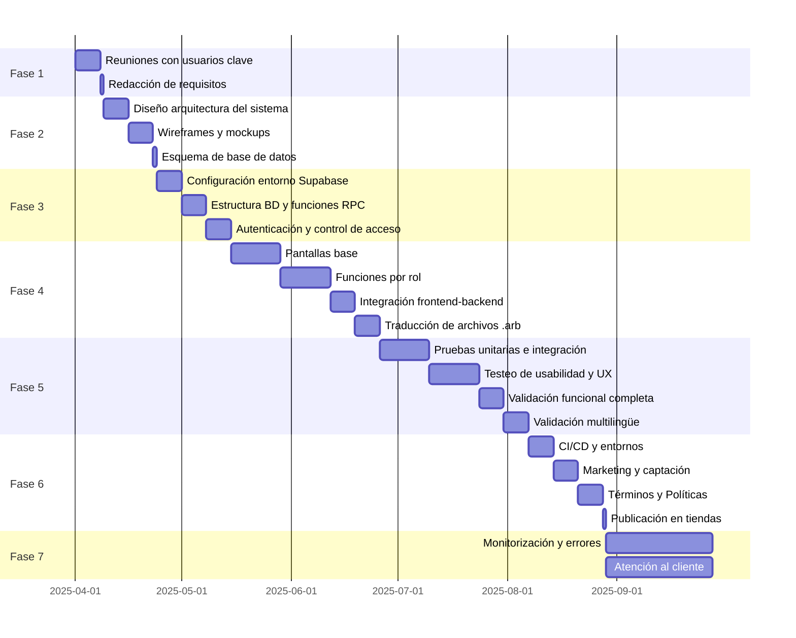
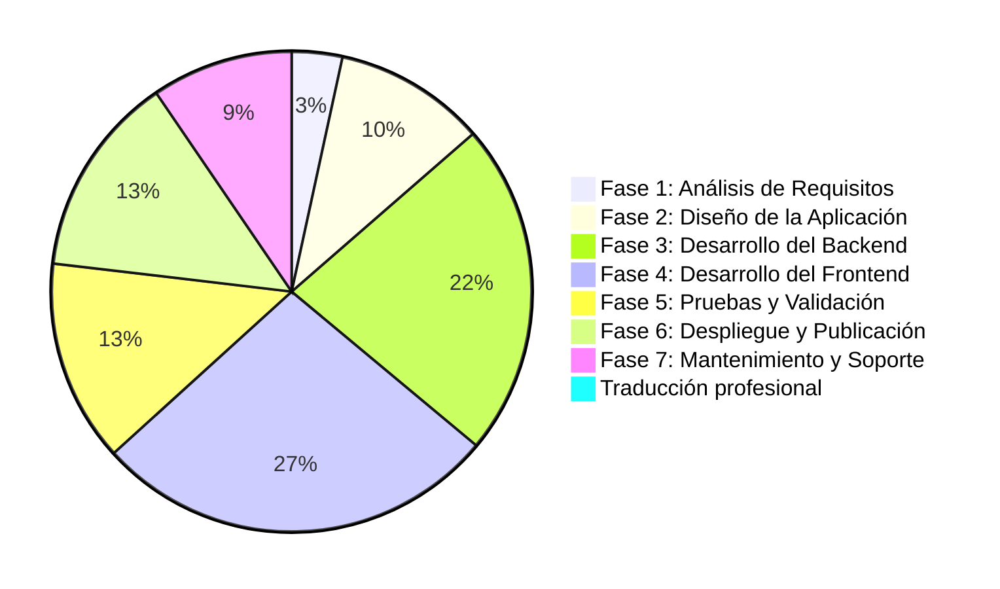
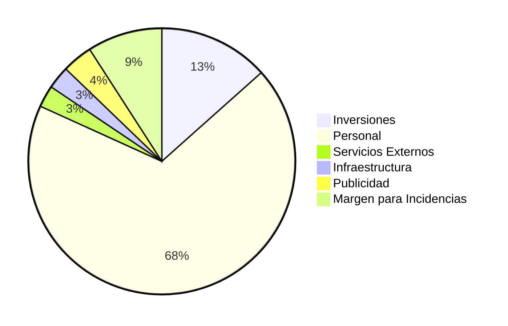

# FASE DE PLANIFICACIÓN DEL PROYECTO

## Objetivos del proyecto
El objetivo principal de este proyecto es **desarrollar una aplicación móvil multiplataforma** que conecte a propietarios de mascotas con paseadores profesionales, 
proporcionando una solución fácil y segura para la gestión de paseos.

## Guía de planificación del proyecto
El proyecto se organiza en 7 fases principales, cada una con tareas definidas, recursos y tiempo estimado:

1. [**Análisis de Requisitos**](#fase-1-análisis-de-requisitos)
2. [**Diseño de la Aplicación**](#fase-2-diseño-de-la-aplicación)
3. [**Desarrollo del Backend**](#fase-3-desarrollo-del-backend)
4. [**Desarrollo del Frontend**](#fase-4-desarrollo-del-frontend)
5. [**Pruebas y Validación**](#fase-5-pruebas-y-validación)
6. [**Despliegue y Publicación**](#fase-6-despliegue-y-publicación)
7. [**Mantenimiento y Soporte**](#fase-7-mantenimiento-y-soporte)

## Metodología
Para el desarrollo de este proyecto se empleará una **metodología de desarrollo incremental**, que permite construir el sistema de forma progresiva a través de entregas funcionales sucesivas.
Este enfoque facilita avanzar por etapas, incorporando mejoras y nuevas funcionalidades sobre versiones anteriores que ya han sido validadas.

## Fases planificadas
### Fase 1: Análisis de Requisitos

 - #### Tarea 1: Reuniones con usuarios clave
   - **Descripción:** Entrevistas con dueños de mascotas y paseadores profesionales para entender sus necesidades.  
   - **Duración:** 1 semana.

 - #### Tarea 2: Redacción de requisitos funcionales y no funcionales  
   - **Descripción:** Documentación detallada de los requisitos identificados.  
   - **Recursos hardware/software:** github/gitlab.
   - **Recursos humanos:** Programador.  
   - **Duración:** 1 dia.

### Fase 2: Diseño de la Aplicación

- #### Tarea 1: Diseño de la arquitectura del sistema  
  - **Descripción:** Definición de la arquitectura general de la app(Se precisará consultar flutter y supabase docs).  
  - **Recursos hardware/software:** Draw.io.
  - **Recursos humanos:** Programador.   
  - **Duración:** 1 semana.

- #### Tarea 2: Creación de wireframes y mockups  
  - **Descripción:** Diseño visual de la interfaz para la app.  
  - **Recursos hardware/software:** Figma, balsamiq/wireframe.cc.
  - **Recursos humanos:** Programador UI/UX.   
  - **Duración:** 1 semana.

- #### Tarea 3: Definición del esquema de base de datos  
  - **Descripción:** Modelado de datos y relaciones en Supabase.  
  - **Recursos hardware/software:** ChartDB/DBDiagram.io.
  - **Recursos humanos:** Programador. 
  - **Duración:** 1 dia.

### Fase 3: Desarrollo del Backend

- #### Tarea 1: Configuración del entorno en Supabase  
  - **Descripción:** Alta del proyecto, configuración de autenticación y permisos.  
  - **Recursos hardware/software:** Supabase.
  - **Recursos humanos:** Programador.   
  - **Duración:** 1 semana.

- #### Tarea 2: Implementación de estructura de base de datos y funciones  
  - **Descripción:** Creación de tablas, relaciones, triggers y funciones RPC.  
  - **Recursos hardware/software:** Supabase.
  - **Recursos humanos:** Programador.   
  - **Duración:** 1 semana.

- #### Tarea 3: Integración de autenticación y control de acceso  
  - **Descripción:** Registro, login, roles...  
  - **Recursos hardware/software:** Supabase Auth, Dart SDK.
  - **Recursos humanos:** Programador.  
  - **Duración:** 1 semana.

### Fase 4: Desarrollo del Frontend

- #### Tarea 1: Implementación de pantallas base (registro, login, perfiles)  
  - **Descripción:** Desarrollo de vistas comunes para cliente y paseador.  
  - **Recursos hardware/software:** Flutter, VsCode.
  - **Recursos humanos:** Programador. 
  - **Duración:** 2 semanas.

- #### Tarea 2: Implementación de funciones por rol (clientes/paseadores)  
  - **Descripción:** Funciones específicas como solicitud de paseo y gestión de agenda.  
  - **Recursos hardware/software:** Flutter,VsCode.
  - **Recursos humanos:** Programador.   
  - **Duración:** 2 semanas.

- #### Tarea 3: Integración frontend-backend  
  - **Descripción:** Conexión a Supabase (datos, autenticación, tiempo real).  
  - **Recursos hardware/software:** Flutter, Supabase Dart SDK, VsCode.
  - **Recursos humanos:** Programador. 
  - **Duración:** 1 semana.

- #### Tarea 4: Traducción profesional de archivos `.arb`  
  - **Descripción:** Traducción a varios idiomas por profesionales.  
  - **Recursos hardware/software:** VSCode.  
  - **Recursos humanos:** Traductores profesionales.  
  - **Duración:** 1 semana.

### Fase 5: Pruebas y Validación

- #### Tarea 1: Pruebas unitarias e integración  
  - **Descripción:** Validación técnica de funcionalidades individuales y compuestas.  
  - **Recursos hardware/software:** Flutter test.
  - **Recursos humanos:** Programador.  
  - **Duración:** 2 semanas.

- #### Tarea 2: Testeo de usabilidad y UX  
  - **Descripción:** Pruebas con usuarios reales sobre la navegación y experiencia.
  - **Recursos humanos:** Voluntarios para beta test.
  - **Duración:** 2 semanas.

- #### Tarea 3: Validación funcional completa  
  - **Descripción:** Validación del flujo real de paseos, pagos, notificaciones.  
  - **Recursos hardware/software:** Dispositivos movil android y ios.
  - **Recursos humanos:** Programador.   
  - **Duración:** 1 semana.

- #### Tarea 4: Validación multilingüe y correcciones  
  - **Descripción:** Revisión lingüística y funcional de las traducciones.   
  - **Recursos humanos:** Voluntarios nativos del idioma especificado.  
  - **Duración:** 1 semana.

### Fase 6: Despliegue y Publicación

- #### Tarea 1: Configuración de CI/CD y entornos  
  - **Descripción:** Automatización de tests, builds y despliegues.  
  - **Recursos hardware/software:** GitHub Actions.
  - **Recursos humanos:** Programador.    
  - **Duración:** 1 semana.

- #### Tarea 2: Marketing digital y captación de usuarios
  - **Descripción:** Planificación e implementación de campañas de lanzamiento (ASO, redes sociales, contenido...).  
  - **Recursos hardware/software:** Consolas de desarrollador de Apple y Google.  
  - **Recursos humanos:** Especialista en marketing digital.
  - **Duración:** 1 semana.

- #### Tarea 3: Creación de Términos, Condiciones y Políticas de Privacidad  
  - **Descripción:** Redacción legal conforme a regulaciones (GPDR, etc.).  
  - **Recursos hardware/software:** Google Docs, plantillas legales.  
  - **Recursos humanos:** Abogado/a especializado/a en tecnología.  
  - **Duración:** 1 semana.

- #### Tarea 4: Publicación en tiendas de aplicaciones  
  - **Descripción:** Subida a Google Play y App Store con pruebas finales.  
  - **Recursos hardware/software:** Consolas de desarrollador de Apple y Google.
  - **Recursos humanos:** Programador.   
  - **Duración:** 1 dia.

### Fase 7: Mantenimiento y Soporte

- #### Tarea 1: Monitorización y resolución de errores  
  - **Descripción:** Soporte post-lanzamiento y mejora continua.  
  - **Recursos hardware/software:** Sentry.
  - **Recursos humanos:** Programador. 
  - **Duración:** Continuo.

- #### Tarea 2: Atención al cliente  
  - **Descripción:** Gestión de dudas, sugerencias y resolución de incidencias.  
  - **Recursos hardware/software:** Plataforma de tickets, correo electrónico.  
  - **Recursos humanos:** Personal de atención al cliente.  
  - **Duración:** Continuo.

---

## Diagrama de Gantt

## Presupuesto
### Presupuesto por Actividades

| ACTIVIDAD                              | DURACIÓN  | COSTE PERSONAS (€)              | COSTE RECURSOS (€)         | COSTE TOTAL ACTIVIDAD (€) |
|----------------------------------------|-----------|----------------------------------|-----------------------------|----------------------------|
| **Fase 1: Análisis de Requisitos**     | 1 semana  | 500 (1 programador)              | 0 (GitHub/GitLab)          | 500                        |
| **Fase 2: Diseño de la Aplicación**    | 2 semanas | 1.000 (1programador)             | 0 (Figma, Draw.io)        | 1.500                      |
| **Fase 3: Desarrollo del Backend**     | 3 semanas | 3.000 (2 programadores Backend)          | 300 (Supabase)              | 3.300                      |
| **Fase 4: Desarrollo del Frontend**    | 4 semanas | 4.000 (2 programadores)          | 0 (Flutter, VSCode)       | 4.000                      |
| **Fase 5: Pruebas y Validación**       | 4 semanas | 1.500 (1 programador-tester)                 | 500 (dispositivos)          | 2.000                      |
| **Fase 6: Despliegue y Publicación**   | 3 semanas | 1.500 (marketing + abogado)      | 500 (Google/Apple Dev)      | 2.000                      |
| **Fase 7: Mantenimiento y Soporte**    | 1 mes     | 1.200 (atención al cliente)      | 200 (Sentry)      | 1.400                      |
| **Traducción profesional**             | 1 semana  | 120 (1.000 palabras × 0,12€)     | -                           | 120                        |
| **Total**                              |           | **13.320**                       | **1.500**                   | **14.820**                 |

### Presupuesto por Partidas de Inversión/Gasto

| CONCEPTO                                        | IMPORTE (€) |
|------------------------------------------------|-----------------|
| **A) INVERSIONES**                             |                 |
| Equipos informáticos (2 ordenadores)           | 2.500           |
| Licencias de software (Balsamiq, DBChart, etc.)   | 400             |
| **Total Inversiones**                          | **2.900**       |
|                                                |                 |
| **B) GASTOS**                                  |                 |
| **Personal**                                   |                 |
| - 2 Programadores (2.000€/mes × 6 meses)       | 12.000          |
| - Especialista en marketing (1.200€/mes × 1 mes)| 1.200           |
| - Abogado/a (30€/página × 10 páginas)          | 300             |
| - Traductores (0,12€/palabra × 1.000 palabras) | 120             |
| - Atención al cliente (1.200€/mes × 1 mes)     | 1.200           |
| **Subtotal Personal**                          | **14.820**      |
|                                                |                 |
| **Servicios Externos**                         |                 |
| - Supabase (plan Pro, 25€/mes × 6 meses)       | 150             |
| - Cuenta de desarrollador Google (único pago)  | 25              |
| - Cuenta de desarrollador Apple (anual)        | 99              |
| - APIs (pasarelas de pago, estimación)         | 300             |
| **Subtotal Servicios**                         | **574**         |
|                                                |                 |
| **Infraestructura**                            |                 |
| - Internet (40€/mes × 6 meses)                 | 240             |
| - Electricidad (60€/mes × 6 meses)             | 360             |
| **Subtotal Infraestructura**                   | **600**         |
|                                                |                 |
| **Publicidad**                                 |                 |
| - Campañas en redes sociales (estimación)      | 800             |
| **Subtotal Publicidad**                        | **800**         |
|                                                |                 |
| **Total Gastos**                               | **16.794**      |
|                                                |                 |
| **PRESUPUESTO (Inversiones + Gastos)**   | **19.694**      |
| **TOTAL PRESUPUESTO (Inversiones + Gastos + Margen Incidencias)**   | **21.664€**      |

> [!note] 
>**Salarios**:  
>   - **Programador**: 2.000 €/mes (salario medio júnior-mid en España).  
>   - **Marketing**: 1.200 €/mes (freelance).  
>   - **Atención al cliente**: 1.200 €/mes (media España).  
>
>**Servicios profesionales**:  
>   - **Abogado**: 30 €/página para términos y condiciones (precio medio en España).  
>   - **Traductor**: 0,12 €/palabra (inglés-español, tarifa estándar).  
>
>**Inversiones**:  
>   - **Ordenadores**: 1.250 €/unidad (configuración media con i5/Ryzen 5 y 16 GB RAM).  
>   - **Supabase**: Plan Pro (25 €/mes) para base de datos y autenticación.  
>
>**Ahorros**:  
>   - Trabajo remoto reduce costes de alquiler de local.  
>   - Uso de herramientas gratuitas (VSCode, Draw.io) siempre que sea posible.  
>
>**Margen de seguridad**:  
>   - Se añade un 10% extra (1.970 €) para imprevistos, resultando en un **total de 21.664 €**.

