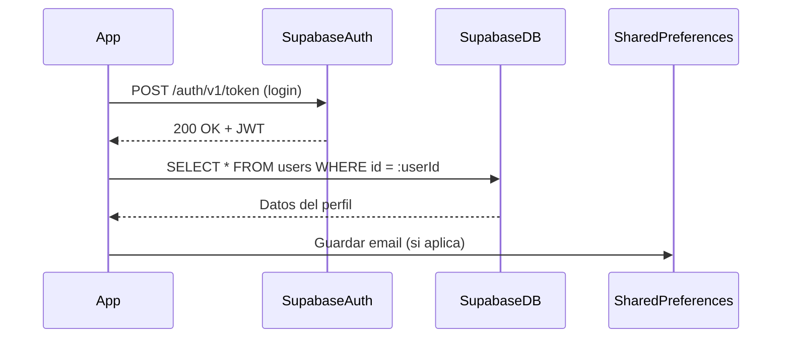
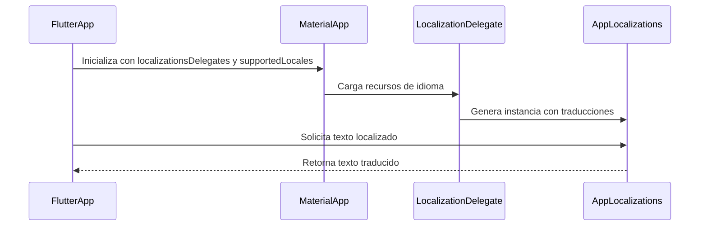
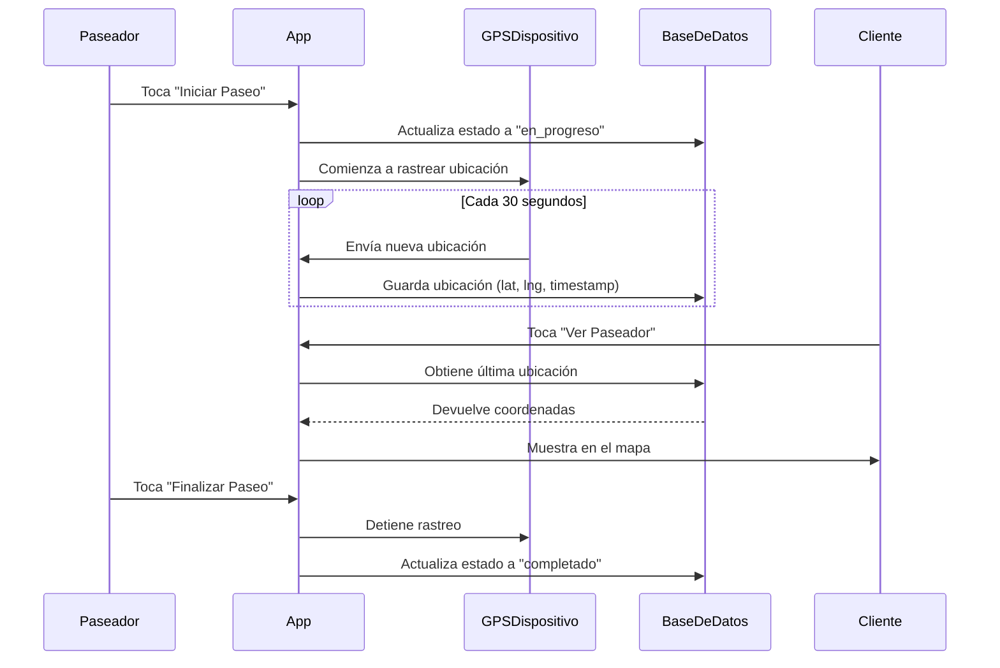

# Fase de implementación

  - [Proceso de Autenticación](#proceso-de-autenticación)
    - [Inicialización de Supabase](#inicialización-de-supabase)
    - [Login](#login)
    - [SharedPreferences](#sharedpreferences)
    - [Registro](#registro)
    - [Restablecer contraseña](#restablecer-contraseña)
  - [Flutter Localizations: Soporte Multilingue](#flutter-localizations-soporte-multilingue)
    - [Persistencia del Idioma Seleccionado](#persistencia-del-idioma-seleccionado)
  - [Geolocalización: Sistema de Rastreo del Paseador](#geolocalización-sistema-de-rastreo-del-paseador)


## Proceso de Autenticación



### Inicialización de Supabase
- Antes de cualquier operación de autenticación, se configura el cliente de Supabase en `main.dart`: 
   
    ``` dart
    void main() async {
        WidgetsFlutterBinding.ensureInitialized();
        await dotenv.load(fileName: ".env"); 
        await Supabase.initialize(
            url: SupabaseCredentials.url,      // SupabaseDB URL
            anonKey: SupabaseCredentials.anonKey, // Public Key
        );
        runApp(MyApp(locale: locale));
    }
    ```
- `SupabaseCredentials` obtiene la URL y la clave desde `.env`.

- `Supabase.initialize()` establece la conexión con el backend.

### Login
Para la gestión de todo el flujo de inicio de sesión de un usuario en la aplicación, utilizamos el método `_login()`:


- **Validación del formulario de inicio de sesión:**

  - Se valida el formulario mediante `_loginFormKey`. Si alguno de los campos (correo o contraseña) es inválido, se detiene el proceso.  
    Esta verificación evita que se intenten enviar datos incompletos o con formato incorrecto al sistema de autenticación.


- **Activación del indicador de carga:**

  - Se actualiza el estado de la interfaz (`setState`) para mostrar un indicador visual que informe al usuario que el proceso de inicio de sesión está en curso.


- **Solicitud de inicio de sesión a Supabase:**

  - Se realiza una llamada asíncrona a `supabase.auth.signInWithPassword()`, pasando como parámetros:

    - El **correo electrónico** (`email`)
    - La **contraseña** (`password`)

  - Supabase verifica esas credenciales y responde con un objeto de tipo `user` si la autenticación fue exitosa.


- **Verificación de la respuesta:**

  - Si el objeto `user` es `null`, se lanza una excepción indicando que el usuario no fue encontrado, lo que evita continuar con una sesión inválida.


- **Almacenamiento de credenciales si se selecciona “Recordar sesión”:**

  - Si el usuario activó la opción del checkbox `RememberMe`, se llama al método `_saveCredentials()` para guardar el email y la contraseña mediante `SharedPreferences`.


- **Redirección tras el inicio de sesión exitoso:**

  - Si todo fue exitoso, se navega automáticamente a la pantalla principal de la aplicación (`/home`) usando `Navigator.pushReplacementNamed()`.


- **Manejo de errores de autenticación:**

  - En caso de error, se capturan dos tipos:
    - **Errores de Supabase** (`AuthException`) que muestran mensajes específicos (por ejemplo, contraseña incorrecta).
    - **Errores generales** (excepciones no controladas) que también se notifican al usuario mediante un `SnackBar`.

``` dart
  /// Handles the login functionality using Supabase.
  Future<void> _login() async {
    if (!_loginFormKey.currentState!.validate()) return;

    setState(() => _isLoading = true);
    try {
      final response = await _supabase.auth.signInWithPassword(
        email: _emailController.text.trim(),
        password: _passwordController.text,
      );

      if (response.user == null) {
        throw Exception('User not found');
      }
      // Save credentials if "Remember Me" is checked
      await _saveCredentials();

      if (!mounted) return;
      Navigator.pushReplacementNamed(context, '/home');
    } on AuthException catch (e) {
      ScaffoldMessenger.of(
        context,
      ).showSnackBar(SnackBar(content: Text('Login failed: ${e.message}')));
    } catch (e) {
      ScaffoldMessenger.of(
        context,
      ).showSnackBar(SnackBar(content: Text('Login failed: ${e.toString()}')));
    } finally {
      if (mounted) setState(() => _isLoading = false);
    }
  }
```
### SharedPreferences
- El método `_saveCredentials()` decide si persiste o elimina las credenciales del usuario según la opción marcada en el checkbox `Remember me`.
  Para ello, utiliza la librería `SharedPreferences` para almacenar los credenciales de forma persistente en el dispositivo en formato **clave-valor**.

- Este proceso conlleva una serie de pasos:
    1. **Instancia de `SharedPreferences`**  
        - `SharedPreferences.getInstance()` abre el almacén clave‑valor persistente del dispositivo.

    2. **Cuando “Recordar sesión” está activado (`_rememberMe == true`)**  
        - Guarda:
            - `'rememberMe' = true` (booleano)
            - `'email' = <correo>` (string)
            - `'password' = <contraseña>` (string)  

        - Estos datos permanecen tras cerrar la app.

    3. **Cuando está desactivado**  
        - Elimina las claves `'rememberMe'`, `'email'` y `'password'` para no conservar información de la sesión.
``` dart
  Future<void> _saveCredentials() async {
    final prefs = await SharedPreferences.getInstance();
    if (_rememberMe) {
      await prefs.setBool('rememberMe', true);
      await prefs.setString('email', _emailController.text);
      await prefs.setString('password', _passwordController.text);
    } else {
      await prefs.remove('rememberMe');
      await prefs.remove('email');
      await prefs.remove('password');
    }
  }
```

### Registro

Para  la gestión de todo el flujo de registro de un nuevo usuario en la aplicación utilizamos el método `_register()`. 


 - **Validación del formulario de registro:**

    - Se valida el formulario usando `_registerFormKey`. Si algún campo (nombre, correo, o contraseña) es inválido, se detiene el proceso inmediatamente. 
      Esto asegura que no se envíen datos incompletos o erróneos al backend.


- **Verificación de aceptación de términos:**

    - Se comprueba si el usuario ha marcado la casilla de aceptación de los términos y condiciones (`_acceptTerms`). Si no lo ha hecho, se muestra un mensaje mediante un `SnackBar` y se interrumpe el registro. Esto es de importancia debido a razones legales y de cumplimiento de políticas.


- **Solicitud de registro a Supabase:**

    - Se realiza una llamada asíncrona a `supabase.auth.signUp()`, enviando:

      - El **correo electrónico** (`email`)
      - La **contraseña**
      - Un **redirect URL** (`emailRedirectTo`) que será usado en el email de verificación
      - Datos adicionales como el **nombre** y el **teléfono**, almacenados en el perfil del usuario

    - Esto crea un nuevo usuario en la base de datos, desde donde Supabase envíará un correo de confirmación de e-mail de forma automática al correo del usuario.


- **Verificación de la respuesta:**

    - Si la respuesta no contiene un objeto `user`, se considera que el registro falló y se lanza una excepción. Esto previene errores silenciosos si el registro fue técnicamente procesado pero sin éxito.


- **Notificación de éxito y limpieza del formulario:**

    - Si el registro fue exitoso, se muestra un `SnackBar` indicando al usuario que revise su correo para verificar la cuenta. Luego, se limpian todos los campos del formulario y se cambia la pestaña activa al formulario de inicio de sesión (`_tabController.animateTo(0)`).


``` dart

  Future<void> _register() async {
    if (!_registerFormKey.currentState!.validate()) return;
    if (!_acceptTerms) {
      ScaffoldMessenger.of(context).showSnackBar(
        const SnackBar(
          content: Text('You must accept the terms and conditions'),
        ),
      );
      return;
    }
    if (!_registerFormKey.currentState!.validate()) return;

    setState(() => _isLoading = true);
    try {
      final response = await _supabase.auth.signUp(
        email: _emailController.text.trim(),
        password: _passwordController.text,
        emailRedirectTo: 'https://fanciful-brioche-0801c9.netlify.app/',
        data: {
          'name': _nameController.text.trim(),
          'phone': _phoneController.text.trim(),
        },
      );

      if (response.user == null) {
        throw Exception('Registration failed');
      }

      if (mounted) {
        ScaffoldMessenger.of(context).showSnackBar(
          const SnackBar(
            content: Text(
              'Registration successful! Please check your email for verification.',
            ),
            duration: Duration(seconds: 5),
          ),
        );
        // Clear form and switch to login tab
        _nameController.clear();
        _phoneController.clear();
        _emailController.clear();
        _passwordController.clear();
        _tabController.animateTo(0);
      }
    } on AuthException catch (e) {
      if (mounted) {
        ScaffoldMessenger.of(context).showSnackBar(
          SnackBar(content: Text('Registration failed: ${e.message}')),
        );
      }
    } catch (e) {
      if (mounted) {
        ScaffoldMessenger.of(context).showSnackBar(
          SnackBar(content: Text('Registration failed: ${e.toString()}')),
        );
      }
    } finally {
      if (mounted) setState(() => _isLoading = false);
    }
  }
```


### Restablecer contraseña

Para permitir que el usuario recupere el acceso a su cuenta en caso de olvidar la contraseña, se utiliza el método `_resetPassword()`.  
Este método envía un correo con un enlace de restablecimiento de contraseña utilizando los servicios de autenticación de Supabase.  


- **Validación del correo electrónico ingresado:**

  - Se verifica que el campo `email` no esté vacío y contenga un símbolo `@`.  
    Si no cumple con estos requisitos, se muestra un `SnackBar` advirtiendo que se debe ingresar un correo válido, y se interrumpe el proceso.


- **Solicitud de envío de enlace de recuperación a Supabase:**

  - Se llama al método `supabase.auth.resetPasswordForEmail(email)`, el cual solicita al backend de Supabase que envíe un correo de restablecimiento de contraseña al email proporcionado.


- **Confirmación de éxito al usuario:**

  - Si el correo se envía correctamente y el widget está montado, se muestra un `AlertDialog` con un mensaje informativo.  
   

- **Manejo de errores de autenticación:**

  - Si Supabase lanza una excepción de tipo (`AuthException`), se captura y se muestra un mensaje descriptivo del error mediante un `SnackBar`.

  - Si ocurre cualquier otro error inesperado (por ejemplo, problemas de red), también se captura y se muestra un mensaje genérico al usuario.


``` dart

Future<void> _resetPassword(String email) async {
    if (email.isEmpty || !email.contains('@')) {
      ScaffoldMessenger.of(context).showSnackBar(
        const SnackBar(content: Text('Please enter a valid email address')),
      );
      return;
    }

    setState(() => _isLoading = true);
    try {
      await _supabase.auth.resetPasswordForEmail(email);
      if (!mounted) return;

      // Show success dialog
      showDialog(
        context: context,
        builder:
            (context) => AlertDialog(
              title: const Text('Password Reset Email Sent'),
              content: Text(
                'A password reset link has been sent to $email. '
                'Please check your inbox and follow the instructions.',
              ),
              actions: [
                TextButton(
                  onPressed: () => Navigator.pop(context),
                  child: const Text('OK'),
                ),
              ],
            ),
      );
    } on AuthException catch (e) {
      if (!mounted) return;
      ScaffoldMessenger.of(
        context,
      ).showSnackBar(SnackBar(content: Text('Error: ${e.message}')));
    } catch (e) {
      if (!mounted) return;
      ScaffoldMessenger.of(
        context,
      ).showSnackBar(SnackBar(content: Text('Error: ${e.toString()}')));
    } finally {
      if (mounted) setState(() => _isLoading = false);
    }
  }
```
---
## Flutter Localizations: Soporte Multilingue
Las **localizaciones** (*localizations*) en Flutter permiten que una aplicación muestre su contenido adaptado al **idioma y región del usuario**, como textos, formatos de fecha, hora, moneda y más.
Este proceso es parte del soporte internacional conocido como **i18n** (internacionalización) y **l10n** (localización).
Para ello, utilizamos  el paquete `flutter_localizations` junto con la generación automática de traducciones mediante `flutter_gen`.


A continuación detallamos el proceso para su implementación en la app:

- Añadir dependencias al fichero `pubspec.yaml`:
``` yaml
  dependencies:
    flutter:
      sdk: flutter
    flutter_localizations:
      sdk: flutter
    intl: any

  flutter:
    generate: true
    uses-material-design: true
```
- Crea la carpeta `lib/l10n` en la ráiz del proyecto
  - Dentro de dicho directorio añadimos los archivos .arb para cada idioma que queremos soportar.
  - Estos ficheros .arb siguen una notación json:

``` json
 {
  "@@locale": "en",
  "welcomeBack": "Welcome back,",
  "@welcomeBack": {
    "description": "Welcome message prefix"
  },
  
  "walletBalance": "Wallet Balance",
  "addFunds": "Deposit",
  "upcomingWalks": "Upcoming Walks",
  "selectLanguage": "Select Language",
  "personalInfo": "Personal Information",
  "firstName": "First Name",
  ...
 }
```
- Ejecutamos el siguiente comando en la terminal para crear las clases `AppLocalizations`:

``` bash
  flutter gen-l10n
```
- Accedemos a las cadenas traducidas utilizando `AppLocalizations.of(context).[nombreDeLaVariable]`:

``` dart
  Text(AppLocalizations.of(context)!.welcome),
```

- Implementación en `main.dart`:
   - El widget `MaterialApp` aplica la traducción en toda la app al recibir el idioma actual (`locale`), la lista de idiomas disponibles (`supportedLocales`) y los delegados (`localizationsDelegates`) que cargan los textos traducidos. 
     
  > [!NOTE]
  > Esto permite que la app muestre su contenido en el idioma elegido por el usuario. 

``` dart
  import 'package:flutter_localizations/flutter_localizations.dart';
  import 'package:flutter_gen/gen_l10n/app_localizations.dart';

  MaterialApp(
    locale: _locale,  // Current language of the app
    supportedLocales: AppLocalizations.supportedLocales,  // Available languages list
    localizationsDelegates: const [
    AppLocalizations.delegate,               // Generated Translations
    GlobalMaterialLocalizations.delegate,  
    GlobalWidgetsLocalizations.delegate,    
    GlobalCupertinoLocalizations.delegate,  
  ],
  ...
);

```
  - La función `setLocale()` del `main.dart` actualiza el estado del idioma actual (`_locale`) y guarda la preferencia del usuario usando LanguageService, para que el idioma se mantenga aunque se cierre la app.

``` dart
  /// Sets the locale of the app and saves the selected language to shared preferences.
  void setLocale(Locale locale) async {
    setState(() {
      _locale = locale;
    });
    // Save the selected language
    await LanguageService.saveLanguage(locale.languageCode);
  }

```
### Persistencia del Idioma Seleccionado 

Para garantizar que la aplicación recuerde el idioma elegido por el usuario incluso después de cerrarla o reiniciarla, se implementa el servicio `language_service.dart`, el cual utiliza la librería `SharedPreferences` para almacenar localmente el código del idioma seleccionado.


``` dart
import 'package:shared_preferences/shared_preferences.dart';

class LanguageService {
  static const String _languageKey = 'selected_language';

  /// Saves the selected language code to shared preferences.
  /// [languageCode] is the language code to be saved (e.g., 'en', 'es', etc.).
  static Future<void> saveLanguage(String languageCode) async {
    final prefs = await SharedPreferences.getInstance();
    await prefs.setString(_languageKey, languageCode);
  }

  /// Retrieves the saved language code from shared preferences.
  static Future<String?> getLanguage() async {
    final prefs = await SharedPreferences.getInstance();
    return prefs.getString(_languageKey);
  }
}

```
- `saveLanguage()` se encarga de guardar el código del idioma en la memoria local del dispositivo.
   Para ello,se usa `SharedPreferences`, que actúa como un sistema de almacenamiento clave-valor persistente.

- `getLanguage()` se invoca en el arranque de la aplicación para recuperar el idioma previamente guardado.


> [!NOTE]  
> La implementación de `flutter_localizations` es una solución escalable para internacionalizar la app, ya que permite gestionar múltiples idiomas mediante archivos `.arb`. Esto facilita agregar nuevas traducciones, mantener el contenido organizado y aprovechar el soporte nativo de Flutter para widgets y formatos localizados, todo sin alterar la lógica principal de la aplicación.


## Geolocalización: Sistema de Rastreo del Paseador

El sistema de rastreo por geolocalización está compuesto por tres módulos principales:

- `location_service.dart`: Acceso al GPS del dispositivo.

- `walk_repository.dart`: Almacenamiento y actualización de ubicaciones.

- `walk_details_page.dart`: Interfaz de usuario para iniciar y visualizar el seguimiento.



A continuación se explica en detalla el proceso de su implementación en la app:

- Añadir dependencias al fichero `pubspec.yaml`:

``` yaml
dependencies:
  geolocator: ^10.0.0  # Para acceso al GPS del dispositivo
  permission_handler: ^10.0.0  # Manejo de permisos en tiempo de ejecución
  url_launcher: ^6.1.11  # Para la redirección a Google maps

```
> [!WARNING]
> Para el correcto funcionamiento de esta funcionalidad, es imprescindible contar con los siguientes permisos:
> - Android(`android/app/src/main/AndroidManifest.xml`)
> ``` xml
> <manifest>
>    <uses-permission android:name="android.permission.ACCESS_NETWORK_STATE"/>
>    <uses-permission android:name="android.permission.ACCESS_COARSE_LOCATION"/>
>    <uses-permission android:name="android.permission.ACCESS_FINE_LOCATION"/>
>    <uses-permission android:name="android.permission.ACCESS_BACKGROUND_LOCATION"/>
>    <uses-permission android:name="android.permission.FOREGROUND_SERVICE"/>
> </manifest>
> ```
> - IOS(`ios/Runner/Info.plist`)
> ``` xml
><dict>
>    <key>NSLocationWhenInUseUsageDescription</key>
>    <string>Necesitamos acceder a tu ubicación para mostrar el recorrido del paseo</string>
>    <key>NSLocationAlwaysAndWhenInUseUsageDescription</key>
>    <string>Necesitamos acceso continuo para rastrear paseos completos</string>
>    <key>NSLocationAlwaysUsageDescription</key>
>    <string>Necesitamos acceso continuo para rastrear paseos completos</string>
>    <key>UIBackgroundModes</key>
>    <array>
>        <string>location</string>
>        <string>fetch</string>
>    </array>
>    <key>NSLocationDefaultAccuracyReduced</key>
>    <false/>
></dict>
> ```


- Implementar la lógico de acceso al gps por `location_service.dart`,la cual gestiona la obtención de la ubicación del dispositivo móvil utilizando permisos y 
  servicios de geolocalización.
  
  - `_checkPermissions()`: Solicita al usuario permiso para acceder a la ubicación. Devuelve `true` si el permiso es concedido.

  - `getCurrentLocation()`: Obtiene la ubicación actual del dispositivo con la mejor precisión disponible. Devuelve un objeto `Position` o `null` si falla.

  - `getLocationStream()`:  Devuelve un `Stream<Position>` que emite actualizaciones en tiempo real de la ubicación, con alta precisión y mínimo movimiento de 10 
     metros entre lecturas.

  
``` dart
import 'package:geolocator/geolocator.dart';
import 'package:permission_handler/permission_handler.dart';

class LocationService {
  static Future<bool> _checkPermissions() async {
    final status = await Permission.location.request();
    return status.isGranted;
  }

  static Future<Position?> getCurrentLocation() async {
    try {
      final hasPermission = await _checkPermissions();
      if (!hasPermission) return null;

      return await Geolocator.getCurrentPosition(
        desiredAccuracy: LocationAccuracy.best,
      );
    } catch (e) {
      print('Error getting location: $e');
      return null;
    }
  }

  static Stream<Position> getLocationStream() {
    return Geolocator.getPositionStream(
      locationSettings: LocationSettings(
        accuracy: LocationAccuracy.best,
        distanceFilter: 10,
      ),
    );
  }
}
```
- Envio de la ubicación del paseador a la base de datos(`walk_repository.dart`).
    - Utilizamos `upsert` en lugar de `insert` para evitar la creación innecesaria de múltiples registros de ubicación por cada caminante, actualizando el registro 
      en su lugar. 

``` dart
Future<void> trackWalkerLocation(String walkId, Position position) async {
  await _supabase.from('walk_locations').upsert({
    'walk_id': walkId,
    'latitude': position.latitude,
    'longitude': position.longitude,
    'updated_at': DateTime.now().toIso8601String(),
  });
}
```
- Implementamos la lógica para iniciar el tracking en la interfaz (`walk_details.dart`):  
  - Al comenzar el paseo, se ejecuta `_startLocationTracking()`, que inicia el seguimiento en tiempo real de la ubicación del *dog walker* (paseador).  
  - Este método asegura que solo el paseador asignado pueda activar el tracking, gestionando permisos de ubicación y enviando actualizaciones constantes al backend 
    durante todo el paseo.  
  - Así, se garantiza un monitoreo continuo y preciso del recorrido, mejorando la experiencia y la seguridad tanto del paseador como del dueño del perro.

      

``` dart
  /// Start tracking the walker's location
  void _startLocationTracking() async {
    // Check if we're the walker
    if (currentUserId != walk.walkerId) return;

    // Check permissions for geolocation
    final status = await Permission.location.request();
    if (!status.isGranted) {
      debugPrint('Location permission denied');
      return;
    }

    // Cancel any existing subscription, preventing posible duplicated records
    _locationStreamSubscription?.cancel();

    // Start listening to location updates
    _locationStreamSubscription = LocationService.getLocationStream().listen(
      (position) async {
        _currentPosition = position;
        try {
          await WalkRepository().trackWalkerLocation(
            walkId: walk.id,
            latitude: position.latitude,
            longitude: position.longitude,
          );
        } catch (e) {
          debugPrint('Failed to update location: $e');
        }
      },
      onError: (e) {
        debugPrint('Location stream error: $e');
      },
    );
  }
```

 - El *dog owner* (dueño del perro) puede consultar la ubicación actual del paseador simplemente tocando el indicador de estado.  
    - Al hacerlo, se dispara el método `_openWalkerLocationInMaps`, que abre Google Maps mostrando la posición más reciente del paseador.  
    - Este flujo permite al dueño del perro monitorear fácilmente el progreso del paseo en tiempo real, garantizando mayor transparencia y confianza durante la 
      caminata.


``` dart
/// Open Google Maps with walker's current location
  Future<void> _openWalkerLocationInMaps(BuildContext context) async {
    try {
      final location = await WalkRepository().getWalkerLocation(walk.id);

      if (location == null ||
          location['latitude'] == null ||
          location['longitude'] == null) {
        ScaffoldMessenger.of(context).showSnackBar(
          SnackBar(content: Text('Walker location not available yet')),
        );
        return;
      }

      final lat = location['latitude'];
      final lng = location['longitude'];
      final url = 'https://www.google.com/maps/search/?api=1&query=$lat,$lng';

      if (await canLaunchUrl(Uri.parse(url))) {
        await launchUrl(Uri.parse(url));
      } else {
        throw 'Could not launch $url';
      }
    } catch (e) {
      ScaffoldMessenger.of(
        context,
      ).showSnackBar(SnackBar(content: Text('Failed to open maps: $e')));
    }
  }
```

- Cuando el paseo termine, la transmisión de la ubicación se detendrá automáticamente.  
- El indicador de estado dejará de responder a eventos, evitando que el dueño intente escuchar actualizaciones una vez finalizado el paseo.
 
``` dart
  Widget _buildStatusHeader(BuildContext context) {
    final statusColor = _getStatusColor(walk.status);
    final isInProgress = walk.status == "in_progress";

    return GestureDetector(
      onTap: () {
        if (isInProgress) {
          _openWalkerLocationInMaps(context);
        }
      },
      child: Container(
        padding: const EdgeInsets.all(16),
        decoration: BoxDecoration(
          ...
        ),
      ),
    ),      
  }
```


