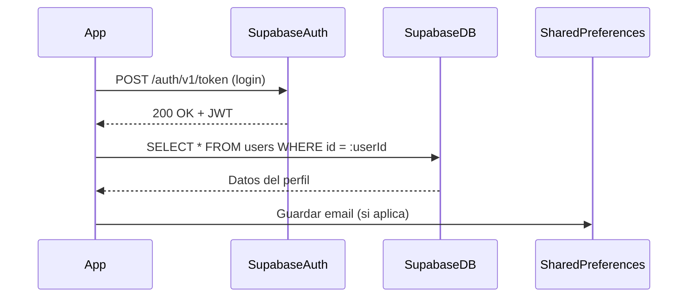
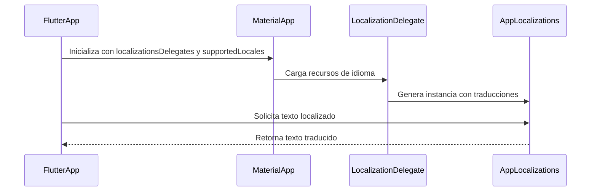
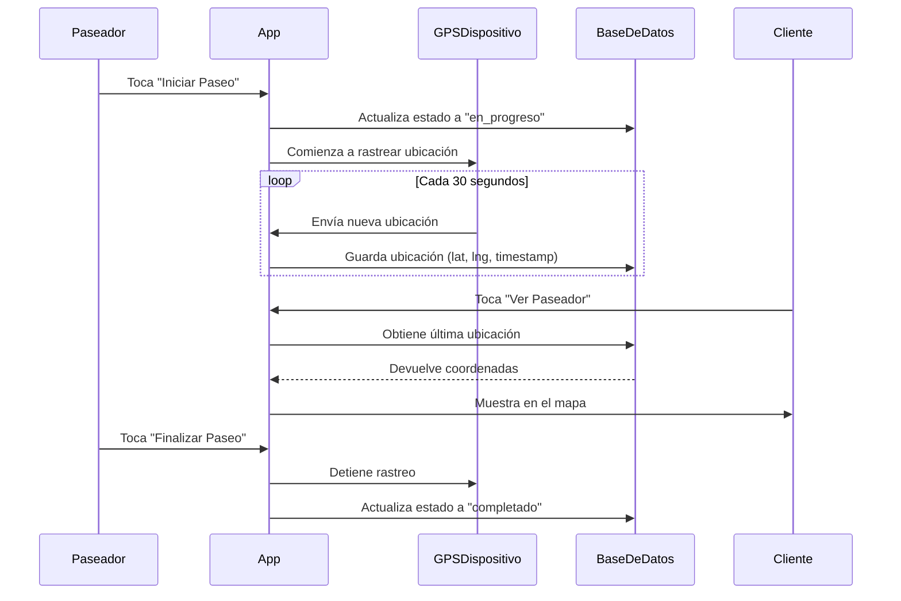
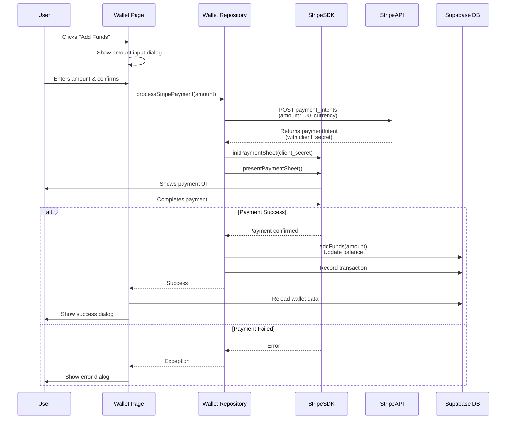

# Fase de implementación

  - [Proceso de Autenticación](#proceso-de-autenticación)
    - [Inicialización de Supabase](#inicialización-de-supabase)
    - [Login](#login)
    - [SharedPreferences](#sharedpreferences)
    - [Registro](#registro)
    - [Restablecer contraseña](#restablecer-contraseña)
  - [Flutter Localizations: Soporte Multilingue](#flutter-localizations-soporte-multilingue)
    - [Persistencia del Idioma Seleccionado](#persistencia-del-idioma-seleccionado)
  - [Geolocalización: Sistema de Rastreo del Paseador](#geolocalización-sistema-de-rastreo-del-paseador)
  - [Pasarela de Pago por Stripe](#pasarela-de-pago-por-stripe)


## Proceso de Autenticación



### Inicialización de Supabase
- Antes de cualquier operación de autenticación, se configura el cliente de Supabase en `main.dart`: 
   
    ``` dart
    void main() async {
        WidgetsFlutterBinding.ensureInitialized();
        await dotenv.load(fileName: ".env"); 
        await Supabase.initialize(
            url: SupabaseCredentials.url,      // SupabaseDB URL
            anonKey: SupabaseCredentials.anonKey, // Public Key
        );
        runApp(MyApp(locale: locale));
    }
    ```
- `SupabaseCredentials` obtiene la URL y la clave desde `.env`.

- `Supabase.initialize()` establece la conexión con el backend.

### Login

El método `_login()` se encarga de gestionar todo el flujo de inicio de sesión de un usuario en la aplicación. 
Primero, valida el formulario utilizando `_loginFormKey` para asegurarse de que tanto el correo como la contraseña sean válidos; si alguno de los campos es incorrecto, el proceso se detiene. Luego, mediante `setState`, se activa un indicador de carga que informa al usuario que el inicio de sesión está en curso. Durante este proceso, se realiza una petición asíncrona a `supabase.auth.signInWithPassword()` pasando el correo y la contraseña como parámetros. Esta llamada verifica las credenciales en Supabase, y si la autenticación es exitosa, se recibe un objeto `user`, en caso contrario nos devolverá `null`, lanzandose entonces una excepción (`AuthException`) indicando al usuario que sus credenciales son incorrectas. En caso de que el usuario haya seleccionado la opción "Remember me", se almacenan las credenciales en `SharedPreferences` mediante el método `_saveCredentials()`. Si el inicio de sesión es exitoso, la aplicación redirige automáticamente a la pantalla principal usando `Navigator.pushReplacementNamed('/home')`. Finalmente, cualquier error durante el proceso es manejado adecuadamente: si se trata de un error de autenticación (`AuthException`), se muestra un mensaje específico; para otros errores generales, se informa al usuario mediante un `SnackBar`.


``` dart
  /// Handles the login functionality using Supabase.
  Future<void> _login() async {
    if (!_loginFormKey.currentState!.validate()) return;

    setState(() => _isLoading = true);
    try {
      final response = await _supabase.auth.signInWithPassword(
        email: _emailController.text.trim(),
        password: _passwordController.text,
      );

      if (response.user == null) {
        throw Exception('User not found');
      }
      // Save credentials if "Remember Me" is checked
      await _saveCredentials();

      if (!mounted) return;
      Navigator.pushReplacementNamed(context, '/home');
    } on AuthException catch (e) {
      ScaffoldMessenger.of(
        context,
      ).showSnackBar(SnackBar(content: Text('Login failed: ${e.message}')));
    } catch (e) {
      ScaffoldMessenger.of(
        context,
      ).showSnackBar(SnackBar(content: Text('Login failed: ${e.toString()}')));
    } finally {
      if (mounted) setState(() => _isLoading = false);
    }
  }
```
### SharedPreferences
El método `_saveCredentials()` decide si persiste o elimina las credenciales del usuario según la opción marcada en el checkbox `Remember me`.
  Para ello, utiliza la librería `SharedPreferences` para almacenar los credenciales de forma persistente en el dispositivo en formato **clave-valor**.

Este proceso conlleva una serie de pasos:

  1. **Instancia de `SharedPreferences`**  
      - `SharedPreferences.getInstance()` abre el almacén clave‑valor persistente del dispositivo.

  2. **Cuando “Recordar sesión” está activado (`_rememberMe == true`)**  
      - Guarda:
        - `'rememberMe' = true` (booleano)
        - `'email' = <correo>` (string)
        - `'password' = <contraseña>` (string)  

      - Estos datos permanecen tras cerrar la app.

  3. **Cuando está desactivado**  
      - Elimina las claves `'rememberMe'`, `'email'` y `'password'` para no conservar información de la sesión.
``` dart
  Future<void> _saveCredentials() async {
    final prefs = await SharedPreferences.getInstance();
    if (_rememberMe) {
      await prefs.setBool('rememberMe', true);
      await prefs.setString('email', _emailController.text);
      await prefs.setString('password', _passwordController.text);
    } else {
      await prefs.remove('rememberMe');
      await prefs.remove('email');
      await prefs.remove('password');
    }
  }
```

### Registro

El método `_register()` maneja todo el proceso de registro de un nuevo usuario en la aplicación. Primero, valida el formulario mediante `_registerFormKey` para asegurarse de que todos los campos requeridos (nombre, correo y contraseña) sean válidos; si alguno es incorrecto, el proceso se detiene. Luego, verifica si el usuario ha aceptado los términos y condiciones a través de la casilla `_acceptTerms`; si no está marcada, se muestra un mensaje con `SnackBar` y se interrumpe el flujo, por razones legales y de cumplimiento. A continuación, se realiza una **petición asíncrona** a `supabase.auth.signUp()`, enviando el correo electrónico, la contraseña, una URL de redirección (`emailRedirectTo`) y datos adicionales como el nombre, que se almacenan en el perfil del usuario. Supabase crea el nuevo usuario y envía automáticamente un correo de verificación. Si la respuesta no contiene un objeto `user`, se lanza una excepción para indicar que el registro falló. En caso de éxito, se muestra un `SnackBar` solicitando al usuario que revise su correo para confirmar la cuenta, se limpian los campos del formulario y se cambia a la pestaña de inicio de sesión.


``` dart

  Future<void> _register() async {
    if (!_registerFormKey.currentState!.validate()) return;
    if (!_acceptTerms) {
      ScaffoldMessenger.of(context).showSnackBar(
        const SnackBar(
          content: Text('You must accept the terms and conditions'),
        ),
      );
      return;
    }
    if (!_registerFormKey.currentState!.validate()) return;

    setState(() => _isLoading = true);
    try {
      final response = await _supabase.auth.signUp(
        email: _emailController.text.trim(),
        password: _passwordController.text,
        emailRedirectTo: 'https://fanciful-brioche-0801c9.netlify.app/',
        data: {
          'name': _nameController.text.trim(),
          'phone': _phoneController.text.trim(),
        },
      );

      if (response.user == null) {
        throw Exception('Registration failed');
      }

      if (mounted) {
        ScaffoldMessenger.of(context).showSnackBar(
          const SnackBar(
            content: Text(
              'Registration successful! Please check your email for verification.',
            ),
            duration: Duration(seconds: 5),
          ),
        );
        // Clear form and switch to login tab
        _nameController.clear();
        _phoneController.clear();
        _emailController.clear();
        _passwordController.clear();
        _tabController.animateTo(0);
      }
    } on AuthException catch (e) {
      if (mounted) {
        ScaffoldMessenger.of(context).showSnackBar(
          SnackBar(content: Text('Registration failed: ${e.message}')),
        );
      }
    } catch (e) {
      if (mounted) {
        ScaffoldMessenger.of(context).showSnackBar(
          SnackBar(content: Text('Registration failed: ${e.toString()}')),
        );
      }
    } finally {
      if (mounted) setState(() => _isLoading = false);
    }
  }
```


### Restablecer contraseña

El método `_resetPassword()` permite al usuario recuperar el acceso a su cuenta en caso de haber olvidado la contraseña. Primero, se valida que el campo de correo electrónico no esté vacío y que contenga un símbolo `@`; si no cumple con estos requisitos, se interrumpe el proceso y se muestra un `SnackBar` indicando que se debe ingresar un correo válido. A continuación, se realiza una **petición asíncrona** a `supabase.auth.resetPasswordForEmail(email)`, que solicita a Supabase el envío de un correo con el enlace de restablecimiento de contraseña. Si la operación es exitosa y el widget está montado, se muestra un `AlertDialog` informando al usuario que revise su correo. En caso de error, se manejan dos escenarios: si se trata de una excepción de tipo `AuthException` lanzada por Supabase, se muestra un mensaje específico mediante un `SnackBar`; si ocurre cualquier otro error inesperado, como problemas de red, también se captura y se notifica al usuario con un mensaje genérico.


``` dart

Future<void> _resetPassword(String email) async {
    if (email.isEmpty || !email.contains('@')) {
      ScaffoldMessenger.of(context).showSnackBar(
        const SnackBar(content: Text('Please enter a valid email address')),
      );
      return;
    }

    setState(() => _isLoading = true);
    try {
      await _supabase.auth.resetPasswordForEmail(email);
      if (!mounted) return;

      // Show success dialog
      showDialog(
        context: context,
        builder:
            (context) => AlertDialog(
              title: const Text('Password Reset Email Sent'),
              content: Text(
                'A password reset link has been sent to $email. '
                'Please check your inbox and follow the instructions.',
              ),
              actions: [
                TextButton(
                  onPressed: () => Navigator.pop(context),
                  child: const Text('OK'),
                ),
              ],
            ),
      );
    } on AuthException catch (e) {
      if (!mounted) return;
      ScaffoldMessenger.of(
        context,
      ).showSnackBar(SnackBar(content: Text('Error: ${e.message}')));
    } catch (e) {
      if (!mounted) return;
      ScaffoldMessenger.of(
        context,
      ).showSnackBar(SnackBar(content: Text('Error: ${e.toString()}')));
    } finally {
      if (mounted) setState(() => _isLoading = false);
    }
  }
```

Una vez que el usuario toca el enlace de restablecimiento recibido por correo, la aplicación lo captura mediante *deep linking* y lo redirige automáticamente a la pantalla para cambiar su contraseña. Para lograr esto, se utiliza la librería `app_links`, la cual permite detectar e interceptar los *deep links* entrantes y manejar su navegación de forma controlada dentro de la aplicación.


``` dart
@override
void initState() {
  super.initState();

  WidgetsBinding.instance.addPostFrameCallback((_) {
    if (widget.initialUri != null) {
      _handleDeepLink(widget.initialUri!);
    }
    _setupDeepLinks(); 
  });
}

void _setupDeepLinks() async {
  final appLinks = AppLinks();

  final initialUri = await appLinks.getInitialLink();
  if (initialUri != null) _handleDeepLink(initialUri);

  appLinks.uriLinkStream.listen(_handleDeepLink);
}

void _handleDeepLink(Uri uri) {
  if (uri.host == 'reset-password') {
    Navigator.push(
      context,
      MaterialPageRoute(builder: (_) => const PasswordResetPage()),
    );
  }
}


```

> [!CAUTION]
> Para implementar *deep linking* a nuestra aplicación debemos añadir al `AndroidManifest.xml` el intent a la página correspondiente a la cual quremos redirigirnos
> ``` xml
>    <intent-filter>
>             <data android:scheme="dogwalkz" android:host="reset-password" />
>             <action android:name="android.intent.action.VIEW" />
>             <category android:name="android.intent.category.DEFAULT" />
>             <category android:name="android.intent.category.BROWSABLE" />
>    </intent-filter>
>
> ```

Al ser redirigido, el usuario verá un formulario donde debe ingresar su nueva contraseña. Al confirmar el cambio, se realiza una **petición asíncrona** a `supabase.auth.updateUser()` para actualizar la contraseña del usuario en la tabla `auth_users`.


```dart
Future<void> _updatePassword() async {
  if (!_formKey.currentState!.validate()) return;
  if (_newPasswordController.text != _confirmPasswordController.text) {
    setState(() => _errorMessage = 'Passwords do not match');
    return;
  }

  setState(() {
    _isLoading = true;
    _errorMessage = null;
  });

  try {
    await _supabase.auth.updateUser(
      UserAttributes(password: _newPasswordController.text),
    );
    setState(() => _isSuccess = true);
  } on AuthException catch (e) {
    setState(() => _errorMessage = e.message);
  } catch (e) {
    setState(() => _errorMessage = 'An unexpected error occurred');
  } finally {
    setState(() => _isLoading = false);
  }
}

```

---
## Flutter Localizations: Soporte Multilingue
Las **localizaciones** (*localizations*) en Flutter permiten que una aplicación muestre su contenido adaptado al **idioma y región del usuario**, como textos, formatos de fecha, hora, moneda y más.
Este proceso es parte del soporte internacional conocido como **i18n** (internacionalización) y **l10n** (localización).
Para ello, utilizamos  el paquete `flutter_localizations` junto con la generación automática de traducciones mediante `flutter_gen`.


A continuación detallamos el proceso para su implementación en la app:

- Añadir dependencias al fichero `pubspec.yaml`:
``` yaml
  dependencies:
    flutter:
      sdk: flutter
    flutter_localizations:
      sdk: flutter
    intl: any

  flutter:
    generate: true
    uses-material-design: true
```
- Crea la carpeta `lib/l10n` en la ráiz del proyecto
  - Dentro de dicho directorio añadimos los archivos .arb para cada idioma que queremos soportar.
  - Estos ficheros .arb siguen una notación json:

``` json
 {
  "@@locale": "en",
  "welcomeBack": "Welcome back,",
  "@welcomeBack": {
    "description": "Welcome message prefix"
  },
  
  "walletBalance": "Wallet Balance",
  "addFunds": "Deposit",
  "upcomingWalks": "Upcoming Walks",
  "selectLanguage": "Select Language",
  "personalInfo": "Personal Information",
  "firstName": "First Name",
  ...
 }
```
- Ejecutamos el siguiente comando en la terminal para crear las clases `AppLocalizations`:

``` bash
  flutter gen-l10n
```
- Accedemos a las cadenas traducidas utilizando `AppLocalizations.of(context).[nombreDeLaVariable]`:

``` dart
  Text(AppLocalizations.of(context)!.welcome),
```

- Implementación en `main.dart`:
   - El widget `MaterialApp` aplica la traducción en toda la app al recibir el idioma actual (`locale`), la lista de idiomas disponibles (`supportedLocales`) y los delegados (`localizationsDelegates`) que cargan los textos traducidos. 
     
  > [!NOTE]
  > Esto permite que la app muestre su contenido en el idioma elegido por el usuario. 

``` dart
  import 'package:flutter_localizations/flutter_localizations.dart';
  import 'package:flutter_gen/gen_l10n/app_localizations.dart';

  MaterialApp(
    locale: _locale,  // Current language of the app
    supportedLocales: AppLocalizations.supportedLocales,  // Available languages list
    localizationsDelegates: const [
    AppLocalizations.delegate,               // Generated Translations
    GlobalMaterialLocalizations.delegate,  
    GlobalWidgetsLocalizations.delegate,    
    GlobalCupertinoLocalizations.delegate,  
  ],
  ...
);

```
  - La función `setLocale()` del `main.dart` actualiza el estado del idioma actual (`_locale`) y guarda la preferencia del usuario usando LanguageService, para que el idioma se mantenga aunque se cierre la app.

``` dart
  /// Sets the locale of the app and saves the selected language to shared preferences.
  void setLocale(Locale locale) async {
    setState(() {
      _locale = locale;
    });
    // Save the selected language
    await LanguageService.saveLanguage(locale.languageCode);
  }

```
### Persistencia del Idioma Seleccionado 

Para garantizar que la aplicación recuerde el idioma elegido por el usuario incluso después de cerrarla o reiniciarla, se implementa el servicio `language_service.dart`, el cual utiliza la librería `SharedPreferences` para almacenar localmente el código del idioma seleccionado.


``` dart
import 'package:shared_preferences/shared_preferences.dart';

class LanguageService {
  static const String _languageKey = 'selected_language';

  /// Saves the selected language code to shared preferences.
  /// [languageCode] is the language code to be saved (e.g., 'en', 'es', etc.).
  static Future<void> saveLanguage(String languageCode) async {
    final prefs = await SharedPreferences.getInstance();
    await prefs.setString(_languageKey, languageCode);
  }

  /// Retrieves the saved language code from shared preferences.
  static Future<String?> getLanguage() async {
    final prefs = await SharedPreferences.getInstance();
    return prefs.getString(_languageKey);
  }
}

```
- `saveLanguage()` se encarga de guardar el código del idioma en la memoria local del dispositivo.
   Para ello,se usa `SharedPreferences`, que actúa como un sistema de almacenamiento clave-valor persistente.

- `getLanguage()` se invoca en el arranque de la aplicación para recuperar el idioma previamente guardado.


> [!NOTE]  
> La implementación de `flutter_localizations` es una solución escalable para internacionalizar la app, ya que permite gestionar múltiples idiomas mediante archivos `.arb`. Esto facilita agregar nuevas traducciones, mantener el contenido organizado y aprovechar el soporte nativo de Flutter para widgets y formatos localizados, todo sin alterar la lógica principal de la aplicación.


## Geolocalización: Sistema de Rastreo del Paseador

El sistema de rastreo por geolocalización está compuesto por tres módulos principales:

- `location_service.dart`: Acceso al GPS del dispositivo.

- `walk_repository.dart`: Almacenamiento y actualización de ubicaciones.

- `walk_details_page.dart`: Interfaz de usuario para iniciar y visualizar el seguimiento.



A continuación se explica en detalla el proceso de su implementación en la app:

- Añadir dependencias al fichero `pubspec.yaml`:

``` yaml
dependencies:
  geolocator: ^10.0.0  # Para acceso al GPS del dispositivo
  permission_handler: ^10.0.0  # Manejo de permisos en tiempo de ejecución
  url_launcher: ^6.1.11  # Para la redirección a Google maps

```
> [!WARNING]
> Para el correcto funcionamiento de esta funcionalidad, es imprescindible contar con los siguientes permisos:
> - Android(`android/app/src/main/AndroidManifest.xml`)
> ``` xml
> <manifest>
>    <uses-permission android:name="android.permission.ACCESS_NETWORK_STATE"/>
>    <uses-permission android:name="android.permission.ACCESS_COARSE_LOCATION"/>
>    <uses-permission android:name="android.permission.ACCESS_FINE_LOCATION"/>
>    <uses-permission android:name="android.permission.ACCESS_BACKGROUND_LOCATION"/>
>    <uses-permission android:name="android.permission.FOREGROUND_SERVICE"/>
> </manifest>
> ```
> - IOS(`ios/Runner/Info.plist`)
> ``` xml
><dict>
>    <key>NSLocationWhenInUseUsageDescription</key>
>    <string>Necesitamos acceder a tu ubicación para mostrar el recorrido del paseo</string>
>    <key>NSLocationAlwaysAndWhenInUseUsageDescription</key>
>    <string>Necesitamos acceso continuo para rastrear paseos completos</string>
>    <key>NSLocationAlwaysUsageDescription</key>
>    <string>Necesitamos acceso continuo para rastrear paseos completos</string>
>    <key>UIBackgroundModes</key>
>    <array>
>        <string>location</string>
>        <string>fetch</string>
>    </array>
>    <key>NSLocationDefaultAccuracyReduced</key>
>    <false/>
></dict>
> ```


- Implementar la lógico de acceso al gps por `location_service.dart`,la cual gestiona la obtención de la ubicación del dispositivo móvil utilizando permisos y 
  servicios de geolocalización.
  
  - `_checkPermissions()`: Solicita al usuario permiso para acceder a la ubicación. Devuelve `true` si el permiso es concedido.

  - `getCurrentLocation()`: Obtiene la ubicación actual del dispositivo con la mejor precisión disponible. Devuelve un objeto `Position` o `null` si falla.

  - `getLocationStream()`:  Devuelve un `Stream<Position>` que emite actualizaciones en tiempo real de la ubicación, con alta precisión y mínimo movimiento de 10 
     metros entre lecturas.

  
``` dart
import 'package:geolocator/geolocator.dart';
import 'package:permission_handler/permission_handler.dart';

class LocationService {
  static Future<bool> _checkPermissions() async {
    final status = await Permission.location.request();
    return status.isGranted;
  }

  static Future<Position?> getCurrentLocation() async {
    try {
      final hasPermission = await _checkPermissions();
      if (!hasPermission) return null;

      return await Geolocator.getCurrentPosition(
        desiredAccuracy: LocationAccuracy.best,
      );
    } catch (e) {
      print('Error getting location: $e');
      return null;
    }
  }

  static Stream<Position> getLocationStream() {
    return Geolocator.getPositionStream(
      locationSettings: LocationSettings(
        accuracy: LocationAccuracy.best,
        distanceFilter: 10,
      ),
    );
  }
}
```
- Envio de la ubicación del paseador a la base de datos(`walk_repository.dart`).
    - Utilizamos `upsert` en lugar de `insert` para evitar la creación innecesaria de múltiples registros de ubicación por cada caminante, actualizando el registro 
      en su lugar. 

``` dart
Future<void> trackWalkerLocation(String walkId, Position position) async {
  await _supabase.from('walk_locations').upsert({
    'walk_id': walkId,
    'latitude': position.latitude,
    'longitude': position.longitude,
    'updated_at': DateTime.now().toIso8601String(),
  });
}
```
- Implementamos la lógica para iniciar el tracking en la interfaz (`walk_details.dart`):  
  - Al comenzar el paseo, se ejecuta `_startLocationTracking()`, que inicia el seguimiento en tiempo real de la ubicación del *dog walker* (paseador).  
  - Este método asegura que solo el paseador asignado pueda activar el tracking, gestionando permisos de ubicación y enviando actualizaciones constantes al backend 
    durante todo el paseo.  
  - Así, se garantiza un monitoreo continuo y preciso del recorrido, mejorando la experiencia y la seguridad tanto del paseador como del dueño del perro.

      

``` dart
  /// Start tracking the walker's location
  void _startLocationTracking() async {
    // Check if we're the walker
    if (currentUserId != walk.walkerId) return;

    // Check permissions for geolocation
    final status = await Permission.location.request();
    if (!status.isGranted) {
      debugPrint('Location permission denied');
      return;
    }

    // Cancel any existing subscription, preventing posible duplicated records
    _locationStreamSubscription?.cancel();

    // Start listening to location updates
    _locationStreamSubscription = LocationService.getLocationStream().listen(
      (position) async {
        _currentPosition = position;
        try {
          await WalkRepository().trackWalkerLocation(
            walkId: walk.id,
            latitude: position.latitude,
            longitude: position.longitude,
          );
        } catch (e) {
          debugPrint('Failed to update location: $e');
        }
      },
      onError: (e) {
        debugPrint('Location stream error: $e');
      },
    );
  }
```

 - El *dog owner* (dueño del perro) puede consultar la ubicación actual del paseador simplemente tocando el indicador de estado.  
    - Al hacerlo, se dispara el método `_openWalkerLocationInMaps`, que abre Google Maps mostrando la posición más reciente del paseador.  
    - Este flujo permite al dueño del perro monitorear fácilmente el progreso del paseo en tiempo real, garantizando mayor transparencia y confianza durante la 
      caminata.


``` dart
/// Open Google Maps with walker's current location
  Future<void> _openWalkerLocationInMaps(BuildContext context) async {
    try {
      final location = await WalkRepository().getWalkerLocation(walk.id);

      if (location == null ||
          location['latitude'] == null ||
          location['longitude'] == null) {
        ScaffoldMessenger.of(context).showSnackBar(
          SnackBar(content: Text('Walker location not available yet')),
        );
        return;
      }

      final lat = location['latitude'];
      final lng = location['longitude'];
      final url = 'https://www.google.com/maps/search/?api=1&query=$lat,$lng';

      if (await canLaunchUrl(Uri.parse(url))) {
        await launchUrl(Uri.parse(url));
      } else {
        throw 'Could not launch $url';
      }
    } catch (e) {
      ScaffoldMessenger.of(
        context,
      ).showSnackBar(SnackBar(content: Text('Failed to open maps: $e')));
    }
  }
```

- Cuando el paseo termine, la transmisión de la ubicación se detendrá automáticamente.  
- El indicador de estado dejará de responder a eventos, evitando que el dueño intente escuchar actualizaciones una vez finalizado el paseo.
 
``` dart
  Widget _buildStatusHeader(BuildContext context) {
    final statusColor = _getStatusColor(walk.status);
    final isInProgress = walk.status == "in_progress";

    return GestureDetector(
      onTap: () {
        if (isInProgress) {
          _openWalkerLocationInMaps(context);
        }
      },
      child: Container(
        padding: const EdgeInsets.all(16),
        decoration: BoxDecoration(
          ...
        ),
      ),
    ),      
  }
```

## Pasarela de Pago por Stripe

Esta sección describe el flujo completo de integración con Stripe para habilitar depósitos de fondos en el monedero del usuario dentro de la aplicación. La implementación se basa en el uso del paquete flutter_stripe junto con la integración de los endpoints de la API de Stripe.


El flujo de pago se estructura en torno a dos métodos principales: 
- `_createPaymentIntent()`
- `processStripePayment()`

Cuando el usuario selecciona la opción de  **Depositar**, se despliega diálogo que le permite ingresar la cantidad deseada para depositar. Una vez que el usuario confirma la cantidad, se ejecuta `processStripePayment`, responsable de orquestar todo el procedimiento de pago.

Este método invoca `_createPaymentIntent`, el cual realiza una solicitud HTTP POST al endpoint de Stripe para generar una intención de pago(*payout*). La intención de pago representa la cantidad que el usuario desea abonar y debe especificarse en la unidad mínima aceptada por Stripe (centavos). Para ello, el método recibe como parámetros la cantidad y la moneda (en este caso, USD ya que estamos en modo TEST), y utiliza la clave secreta de Stripe para autenticar la solicitud(protegida en el .env).

Si la creación de la intención es exitosa, se recibe un objeto de tipo Map<String, dynamic> que contiene los detalles de la intención, incluyendo el `client_secret`, necesarioa para continuar con el proceso de autorización y confirmación del pago.

``` dart
  Future<Map<String, dynamic>> _createPaymentIntent(
    double amount,
    String currency,
  ) async {
    try {
      final response = await http.post(
        Uri.parse('https://api.stripe.com/v1/payment_intents'),
        headers: {
          'Authorization': 'Bearer $_stripeSecretKey',
          'Content-Type': 'application/x-www-form-urlencoded',
        },
        body: {
          'amount': (amount * 100).toStringAsFixed(0), // Amount in cents
          'currency': currency.toLowerCase(),
        },
      );

      return Map<String, dynamic>.from(json.decode(response.body));
    } catch (e) {
      throw Exception('Failed to create payment intent: $e');
    }
  }
```

Una vez que se obtiene la intención de pago(*payout*), `processStripePayment` continúa el flujo inicializando la hoja de pago de Stripe (**Payment Sheet**) con los parámetros requeridos, incluyendo el `client_secret`, el nombre del comercio, y el tema visual. Luego presenta la hoja de pago al usuario para que pueda completar el pago mediante su tarjeta u otro método habilitado. Si la transacción se completa correctamente, el método llama a addFunds para registrar el depósito en el monedero del usuario con una breve descripción. En caso contario, ya sea específico de Stripe o general, se lanzaría una excepción mostrando al usuario un dialogo de pago fallido.

``` dart
/// Processes a Stripe payment and adds funds to the wallet
  Future<void> processStripePayment({
    required String userId,
    required String walletId,
    required double amount,
    required BuildContext context,
  }) async {
    try {
      // 1. Create payment intent on Stripe
      final paymentIntent = await _createPaymentIntent(amount, 'USD');

      // 2. Initialize payment sheet
      await Stripe.instance.initPaymentSheet(
        paymentSheetParameters: SetupPaymentSheetParameters(
          paymentIntentClientSecret: paymentIntent['client_secret'],
          merchantDisplayName: 'DogWalkz',
          style: ThemeMode.light,
        ),
      );

      // 3. Display payment sheet
      await Stripe.instance.presentPaymentSheet();

      // 4. If payment is successful, add funds to wallet
      await addFunds(
        userId: userId,
        walletId: walletId,
        amount: amount,
        description: 'Stripe deposit',
      );
    } on StripeException catch (e) {
      throw Exception('Payment failed: ${e.error.localizedMessage}');
    } catch (e) {
      throw Exception('Payment failed: $e');
    }
  }
```

> [!IMPORTANT]
> Para integrar correctamente la pasarela de pago con Stripe, es necesario agregar la dependencia `flutter_stripe` en el archivo `pubspec.yaml` de tu proyecto:
>
> ```bash
> flutter pub add flutter_stripe
> ```
>
> Además, se deben aplicar ciertas configuraciones adicionales en los archivos específicos de cada plataforma:
>
> - **Android:** `build.gradle.kts` y `settings.gradle.kts`  
> - **iOS:** `Podfile`
>
> Para más detalles sobre estas configuraciones, consulta la documentación oficial del paquete en [https://pub.dev/packages/flutter_stripe](https://pub.dev/packages/flutter_stripe).


