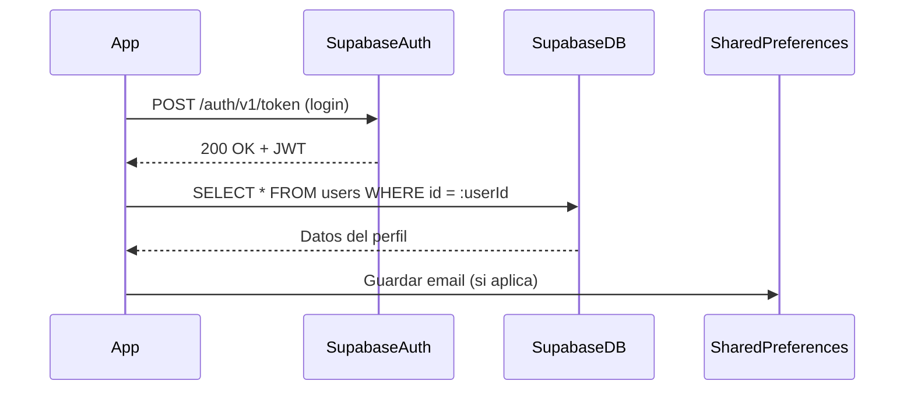

# Fase de implementación

## Proceso de Autenticación



### Inicialización de Supabase
- Antes de cualquier operación de autenticación, se configura el cliente de Supabase en `main.dart`: 
   
    ``` dart
    void main() async {
        WidgetsFlutterBinding.ensureInitialized();
        await dotenv.load(fileName: ".env"); 
        await Supabase.initialize(
            url: SupabaseCredentials.url,      // SupabaseDB URL
            anonKey: SupabaseCredentials.anonKey, // Public Key
        );
        runApp(MyApp(locale: locale));
    }
    ```
- `SupabaseCredentials` obtiene la URL y la clave desde `.env`.

- `Supabase.initialize()` establece la conexión con el backend.

### Login
Para la gestión de todo el flujo de inicio de sesión de un usuario en la aplicación, utilizamos el método `_login()`:


- **Validación del formulario de inicio de sesión:**

  - Se valida el formulario mediante `_loginFormKey`. Si alguno de los campos (correo o contraseña) es inválido, se detiene el proceso.  
    Esta verificación evita que se intenten enviar datos incompletos o con formato incorrecto al sistema de autenticación.


- **Activación del indicador de carga:**

  - Se actualiza el estado de la interfaz (`setState`) para mostrar un indicador visual que informe al usuario que el proceso de inicio de sesión está en curso.


- **Solicitud de inicio de sesión a Supabase:**

  - Se realiza una llamada asíncrona a `supabase.auth.signInWithPassword()`, pasando como parámetros:

    - El **correo electrónico** (`email`)
    - La **contraseña** (`password`)

  - Supabase verifica esas credenciales y responde con un objeto de tipo `user` si la autenticación fue exitosa.


- **Verificación de la respuesta:**

  - Si el objeto `user` es `null`, se lanza una excepción indicando que el usuario no fue encontrado, lo que evita continuar con una sesión inválida.


- **Almacenamiento de credenciales si se selecciona “Recordar sesión”:**

  - Si el usuario activó la opción del checkbox `RememberMe`, se llama al método `_saveCredentials()` para guardar el email y la contraseña mediante `SharedPreferences`.


- **Redirección tras el inicio de sesión exitoso:**

  - Si todo fue exitoso, se navega automáticamente a la pantalla principal de la aplicación (`/home`) usando `Navigator.pushReplacementNamed()`.


- **Manejo de errores de autenticación:**

  - En caso de error, se capturan dos tipos:
    - **Errores de Supabase** (`AuthException`) que muestran mensajes específicos (por ejemplo, contraseña incorrecta).
    - **Errores generales** (excepciones no controladas) que también se notifican al usuario mediante un `SnackBar`.

``` dart
  /// Handles the login functionality using Supabase.
  Future<void> _login() async {
    if (!_loginFormKey.currentState!.validate()) return;

    setState(() => _isLoading = true);
    try {
      final response = await _supabase.auth.signInWithPassword(
        email: _emailController.text.trim(),
        password: _passwordController.text,
      );

      if (response.user == null) {
        throw Exception('User not found');
      }
      // Save credentials if "Remember Me" is checked
      await _saveCredentials();

      if (!mounted) return;
      Navigator.pushReplacementNamed(context, '/home');
    } on AuthException catch (e) {
      ScaffoldMessenger.of(
        context,
      ).showSnackBar(SnackBar(content: Text('Login failed: ${e.message}')));
    } catch (e) {
      ScaffoldMessenger.of(
        context,
      ).showSnackBar(SnackBar(content: Text('Login failed: ${e.toString()}')));
    } finally {
      if (mounted) setState(() => _isLoading = false);
    }
  }
```
### SharedPreferences
- El método `_saveCredentials()` decide si persiste o elimina las credenciales del usuario según la opción marcada en el checkbox `Remember me`.
  Para ello, utiliza la librería `SharedPreferences` para almacenar los credenciales de forma persistente en el dispositivo en formato **clave-valor**.

- Este proceso conlleva una serie de pasos:
    1. **Instancia de `SharedPreferences`**  
        - `SharedPreferences.getInstance()` abre el almacén clave‑valor persistente del dispositivo.

    2. **Cuando “Recordar sesión” está activado (`_rememberMe == true`)**  
        - Guarda:
            - `'rememberMe' = true` (booleano)
            - `'email' = <correo>` (string)
            - `'password' = <contraseña>` (string)  

        - Estos datos permanecen tras cerrar la app.

    3. **Cuando está desactivado**  
        - Elimina las claves `'rememberMe'`, `'email'` y `'password'` para no conservar información de la sesión.
``` dart
  Future<void> _saveCredentials() async {
    final prefs = await SharedPreferences.getInstance();
    if (_rememberMe) {
      await prefs.setBool('rememberMe', true);
      await prefs.setString('email', _emailController.text);
      await prefs.setString('password', _passwordController.text);
    } else {
      await prefs.remove('rememberMe');
      await prefs.remove('email');
      await prefs.remove('password');
    }
  }
```

## Registro

Para  la gestión de todo el flujo de registro de un nuevo usuario en la aplicación utilizamos el método `_register()`. 
A continuación se detalla cada paso de forma estructurada:


 - **Validación del formulario de registro:**

    - Se valida el formulario usando `_registerFormKey`. Si algún campo (nombre, correo, o contraseña) es inválido, se detiene el proceso inmediatamente. 
      Esto asegura que no se envíen datos incompletos o erróneos al backend.


- **Verificación de aceptación de términos:**

    - Se comprueba si el usuario ha marcado la casilla de aceptación de los términos y condiciones (`_acceptTerms`). Si no lo ha hecho, se muestra un mensaje mediante un `SnackBar` y se interrumpe el registro. Esto es de importancia debido a razones legales y de cumplimiento de políticas.


- **Solicitud de registro a Supabase:**

    - Se realiza una llamada asíncrona a `supabase.auth.signUp()`, enviando:

      - El **correo electrónico** (`email`)
      - La **contraseña**
      - Un **redirect URL** (`emailRedirectTo`) que será usado en el email de verificación
      - Datos adicionales como el **nombre** y el **teléfono**, almacenados en el perfil del usuario

    - Esto crea un nuevo usuario en la base de datos, desde donde Supabase envíará un correo de confirmación de e-mail de forma automática al correo del usuario.


- **Verificación de la respuesta:**

    - Si la respuesta no contiene un objeto `user`, se considera que el registro falló y se lanza una excepción. Esto previene errores silenciosos si el registro fue técnicamente procesado pero sin éxito.


- **Notificación de éxito y limpieza del formulario:**

    - Si el registro fue exitoso, se muestra un `SnackBar` indicando al usuario que revise su correo para verificar la cuenta. Luego, se limpian todos los campos del formulario y se cambia la pestaña activa al formulario de inicio de sesión (`_tabController.animateTo(0)`).


``` dart

  Future<void> _register() async {
    if (!_registerFormKey.currentState!.validate()) return;
    if (!_acceptTerms) {
      ScaffoldMessenger.of(context).showSnackBar(
        const SnackBar(
          content: Text('You must accept the terms and conditions'),
        ),
      );
      return;
    }
    if (!_registerFormKey.currentState!.validate()) return;

    setState(() => _isLoading = true);
    try {
      final response = await _supabase.auth.signUp(
        email: _emailController.text.trim(),
        password: _passwordController.text,
        emailRedirectTo: 'https://fanciful-brioche-0801c9.netlify.app/',
        data: {
          'name': _nameController.text.trim(),
          'phone': _phoneController.text.trim(),
        },
      );

      if (response.user == null) {
        throw Exception('Registration failed');
      }

      if (mounted) {
        ScaffoldMessenger.of(context).showSnackBar(
          const SnackBar(
            content: Text(
              'Registration successful! Please check your email for verification.',
            ),
            duration: Duration(seconds: 5),
          ),
        );
        // Clear form and switch to login tab
        _nameController.clear();
        _phoneController.clear();
        _emailController.clear();
        _passwordController.clear();
        _tabController.animateTo(0);
      }
    } on AuthException catch (e) {
      if (mounted) {
        ScaffoldMessenger.of(context).showSnackBar(
          SnackBar(content: Text('Registration failed: ${e.message}')),
        );
      }
    } catch (e) {
      if (mounted) {
        ScaffoldMessenger.of(context).showSnackBar(
          SnackBar(content: Text('Registration failed: ${e.toString()}')),
        );
      }
    } finally {
      if (mounted) setState(() => _isLoading = false);
    }
  }
```


## Restablecer contraseña

Para permitir que el usuario recupere el acceso a su cuenta en caso de olvidar la contraseña, se utiliza el método `_resetPassword()`.  
Este método envía un correo con un enlace de restablecimiento de contraseña utilizando los servicios de autenticación de Supabase.  


- **Validación del correo electrónico ingresado:**

  - Se verifica que el campo `email` no esté vacío y contenga un símbolo `@`.  
    Si no cumple con estos requisitos, se muestra un `SnackBar` advirtiendo que se debe ingresar un correo válido, y se interrumpe el proceso.


- **Solicitud de envío de enlace de recuperación a Supabase:**

  - Se llama al método `supabase.auth.resetPasswordForEmail(email)`, el cual solicita al backend de Supabase que envíe un correo de restablecimiento de contraseña al email proporcionado.


- **Confirmación de éxito al usuario:**

  - Si el correo se envía correctamente y el widget está montado, se muestra un `AlertDialog` con un mensaje informativo.  
   

- **Manejo de errores de autenticación:**

  - Si Supabase lanza una excepción de tipo (`AuthException`), se captura y se muestra un mensaje descriptivo del error mediante un `SnackBar`.

  - Si ocurre cualquier otro error inesperado (por ejemplo, problemas de red), también se captura y se muestra un mensaje genérico al usuario.


``` dart

Future<void> _resetPassword(String email) async {
    if (email.isEmpty || !email.contains('@')) {
      ScaffoldMessenger.of(context).showSnackBar(
        const SnackBar(content: Text('Please enter a valid email address')),
      );
      return;
    }

    setState(() => _isLoading = true);
    try {
      await _supabase.auth.resetPasswordForEmail(email);
      if (!mounted) return;

      // Show success dialog
      showDialog(
        context: context,
        builder:
            (context) => AlertDialog(
              title: const Text('Password Reset Email Sent'),
              content: Text(
                'A password reset link has been sent to $email. '
                'Please check your inbox and follow the instructions.',
              ),
              actions: [
                TextButton(
                  onPressed: () => Navigator.pop(context),
                  child: const Text('OK'),
                ),
              ],
            ),
      );
    } on AuthException catch (e) {
      if (!mounted) return;
      ScaffoldMessenger.of(
        context,
      ).showSnackBar(SnackBar(content: Text('Error: ${e.message}')));
    } catch (e) {
      if (!mounted) return;
      ScaffoldMessenger.of(
        context,
      ).showSnackBar(SnackBar(content: Text('Error: ${e.toString()}')));
    } finally {
      if (mounted) setState(() => _isLoading = false);
    }
  }
```

